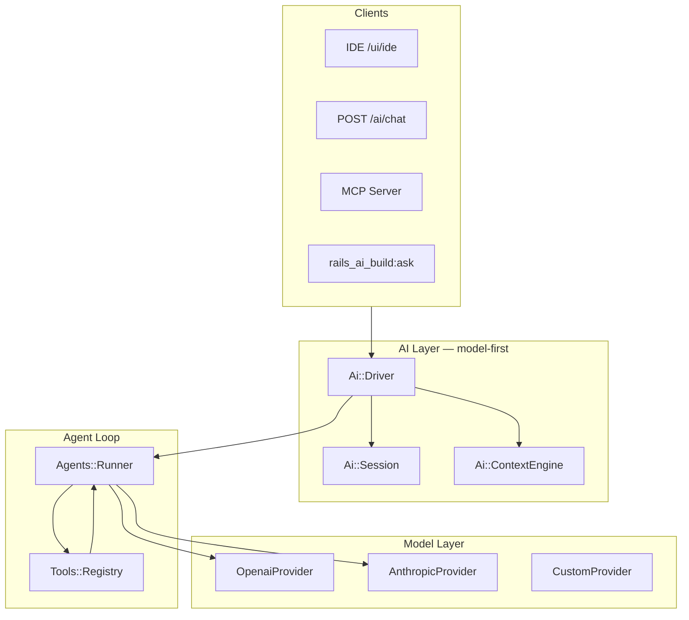

# AI Architecture — Model-first (like Cursor & Claude)

> **Principle:** The **model is the brain**. Everything else — tools, context, sessions, UI — exists to serve the model loop.

## How Cursor / Claude work

```
User message
    ↓
Context assembly (automatic — codebase, rules, history)
    ↓
Model call (Claude / GPT / etc.)  ← THE CORE
    ↓
Tool calls? → execute → feed results back to model
    ↓
Repeat until model stops
    ↓
Stream tokens to UI
```

Rails AI Build v2.1 implements this as **`Ai::Driver`** — one entry point for chat, IDE, build, tasks, and MCP.

## Stack



## Ai::Driver

The **only** programmatic entry point you need:

```ruby
# One-shot (like Claude message)
RailsAiBuild::Ai::Driver.run("Add health check endpoint")

# Multi-turn session (like Cursor chat thread)
session = RailsAiBuild::Ai::Session.create(model: "gpt-4o", provider: :openai)
RailsAiBuild::Ai::Driver.run("List all models", session: session)
RailsAiBuild::Ai::Driver.run("Add validations to the first one", session: session)

# Streaming (like Cursor SSE)
RailsAiBuild::Ai::Driver.stream("Refactor User model") { |event| puts event }
```

## Ai::ContextEngine

Before **every** model call, context is assembled automatically:

| Source | Injected |
|--------|----------|
| ConventionDetector | RSpec/Minitest, Hotwire, API-only, jobs |
| application_info | Rails version, gem stack |
| Session history | Prior turns in thread |
| Memory::Store | Project-specific facts |
| Builder::Context | Universal build rules |

The model always sees the **current truth** of the app — not stale assumptions.

## Ai::Session

Claude-style conversation threads:

```ruby
session = Ai::Session.create(title: "Billing feature")
Driver.run("Add Stripe", session: session)
Driver.run("Add webhook handler", session: session)  # remembers prior turn
```

Persisted via `ConversationRecord` when AR available; in-memory fallback otherwise.

## API (Claude/Cursor compatible shape)

```bash
# Non-streaming
POST /rails_ai_build/ai/chat
{
  "message": "Add pagination to users",
  "model": "gpt-4o",
  "provider": "openai",
  "session_id": "optional-uuid"
}

# Streaming SSE
POST /rails_ai_build/ai/stream
{
  "message": "Fix failing spec",
  "session_id": "..."
}
```

### SSE events

| Event | When |
|-------|------|
| `session` | Session id + model info |
| `context` | Context engine snapshot (auto-gathered) |
| `delta` | Model text chunk |
| `tool_call` | Model requested a tool |
| `tool_result` | Tool finished |
| `done` | Final result + usage |

## What routes through Driver

| Before (v2.0) | After (v2.1) |
|---------------|--------------|
| `ChatService.ask` | `Ai::Driver.run` |
| `POST /chat` | `POST /ai/chat` (+ `/chat` alias) |
| `POST /stream` | `POST /ai/stream` (+ `/stream` alias) |
| `Tasks::Runtime` | Uses Driver internally |
| IDE prompt | Calls `/ai/stream` |

## Model providers

| Provider | Models | Tools |
|----------|--------|-------|
| `:openai` | gpt-4o, o1, o3-mini… | ✅ function calling |
| `:anthropic` | claude-sonnet-4, opus-4… | ✅ tool_use |
| Custom | Ollama, Groq, Together | ✅ via CustomProvider |

Configure once:

```ruby
RailsAiBuild.configure do |config|
  config.default_provider = :anthropic
  config.default_model = "claude-sonnet-4-20250514"
  config.api_keys[:anthropic] = ENV["ANTHROPIC_API_KEY"]
end
```

## Why model-first matters

| Bolt-on AI | Model-first AI (this gem) |
|------------|---------------------------|
| Prompt → hope | Context → model → tools → verify loop |
| Single shot | Multi-turn sessions |
| Sync only | Stream deltas to UI |
| Generic prompts | Auto-detected Rails conventions |
| Separate chat/build/IDE | One Driver, many clients |

## Roadmap

| Version | AI layer |
|---------|----------|
| **v2.1** ✅ | Ai::Driver, Session, ContextEngine, /ai/chat, /ai/stream |
| v2.2 | Real token streaming from OpenAI/Anthropic APIs |
| v2.3 | Embeddings + semantic file retrieval (Cursor @-context) |
| v2.4 | Model routing (cheap model plans, expensive model codes) |
