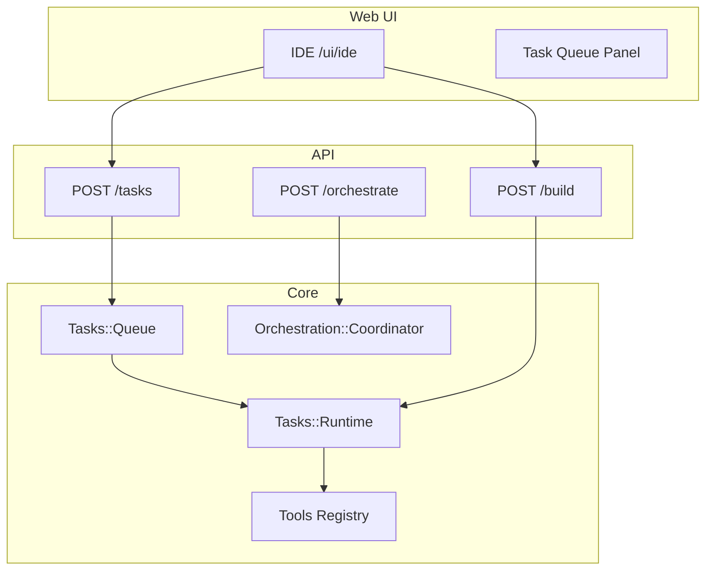

# Platform Roadmap v2 — Cursor for Rails

> **Vision:** Every Rails application gets a full AI platform — build anything, multitask like Cursor, enterprise-ready like GitHub.

## Stack today (v1.9)

| Layer | Status |
|-------|--------|
| Universal Builder | ✅ verify-and-restart loop |
| Rails Boost MCP | ✅ 9 introspection tools |
| In-app IDE | ✅ dark/light/enterprise themes |
| 1000-repo compatibility | ✅ catalog + smoke CI |
| Enterprise gates | ✅ SSO/RBAC/audit/GitHub PR |

## v2.0 — Multitask platform (this release)

| Deliverable | Description |
|-------------|-------------|
| **Task Queue** | `POST /tasks` enqueue, `GET /tasks/:id` poll, parallel workers |
| **`list_migrations`** | Pending migration detection |
| **`model_attributes`** | Column/association detail per model |
| **`run_until_green`** | Orchestrator verify loop (planner→coder→reviewer→fix) |
| **IDE tasks panel** | Queue UI + Build mode (`POST /build`) |
| **Platform config** | `max_concurrent_tasks`, `multitask_enabled` |

```bash
# Enqueue background builds
curl -X POST /rails_ai_build/tasks -d '{"task":"Add billing module"}'
curl GET /rails_ai_build/tasks

# Orchestrate until green
curl -X POST /rails_ai_build/orchestrate -d '{"task":"...","until_green":true}'
```

## v2.1 — Git isolation ✅

| Item | Detail |
|------|--------|
| Branch-per-task | `Integrations::Git.create_branch` on enqueue (`branch_per_task`) |
| PR auto-link | `auto_pr_on_complete` → GitHub compare URL per completed task |
| Merge gate | Reviewer + human HITL before merge to main (via Changes::Store) |
| Worktrees | Optional git worktree per parallel task (v2.3) |

## v2.2 — Real-time platform ✅

| Item | Detail |
|------|--------|
| `POST /build/stream` | SSE for universal builder |
| `POST /tasks/:id/stream` | Per-task event stream |
| Token streaming | Provider delta events in IDE |
| Conversation threads | `GET/POST /ai/sessions` + IDE sidebar |

## v2.3 — Rails AI Cloud

| Item | Detail |
|------|--------|
| Hosted agents | No API key in host app |
| Team workspaces | Shared task queue + audit |
| Credits & usage | Per-seat billing |
| Marketplace packs | Catalog-derived skill packs |

## v2.4 — Full Cursor parity

| Item | Detail |
|------|--------|
| Monaco editor | In-browser edit + @-mentions |
| Terminal panel | Sandboxed shell UI |
| Composer mode | Multi-file plan preview |
| Background agents | Cloud Agents API bridge |
| Rules / skills sync | `.cursor/rules` ↔ gem skills |

## Architecture



## Success metrics

- Any Rails 7.0–8.1 app: `rails rails_ai_build:build['anything']` completes with verify pass
- 2+ tasks enqueued without workspace corruption
- IDE shows live task status without page reload
- Enterprise customer: audit log captures every queued task
